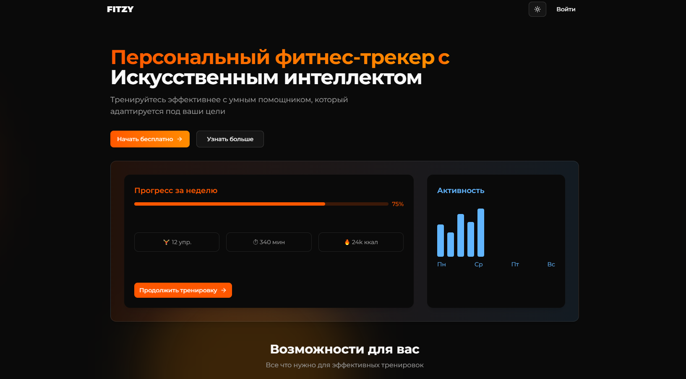
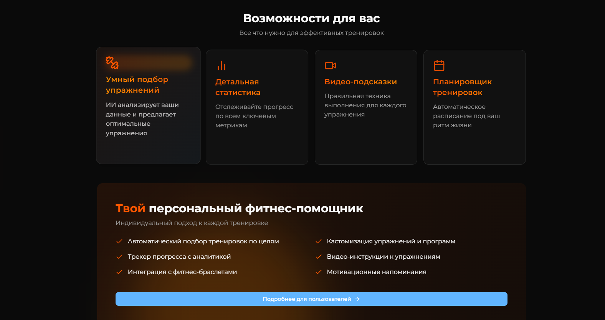

    

        <h1>Привет, я Руслан</h1>
        <h3>Backend developer from Moscow</h3>
        <h5>Сейчас активно углубляюсь в NestJS и осваиваю DevOps-инструменты</h5>
        
    

---
## 🚀 Достижения

- 🥈 **2 место** — Чемпионат «Московские мастера» (Машинное обучение и большие данные)
- 🙋‍♂️ **Участник** TenderHack 2025 ([Swagger API](https://backend.tenderhack.ober0.ru/api))
- 🥇 **1 место** — хакатон "KS54 Hack 2025"
- 🥇 **1 место** — хакатон "KS54 Hack 2024"
- 🎖 **Финалист** олимпиады «Траектория будущего» (Python и ML)
- 📈 **Лучший проект** на научной конференции «Беспилотные технологии и устройства»

---

### ◾ ** Попробуйте Fitzy — персональный фитнес-трекер **
[-00CED1?style=for-the-badge)](https://fitzy.ru/)

  
  

---

## 💻 Языки программирования

## ⚡ Технологии

#### 🔥 **Backend Frameworks & Libraries**

#### 💾 **Databases & ORMs**

#### Message Brokers

#### ⚙️ **Infrastructure & Deployment**

#### 🔄 **Messaging & Asynchronous Processing**

####  **Authentication & Security**

#### 📊 **Data Science & ML**

#### **Other**

---

##  🔥 Статистика :

